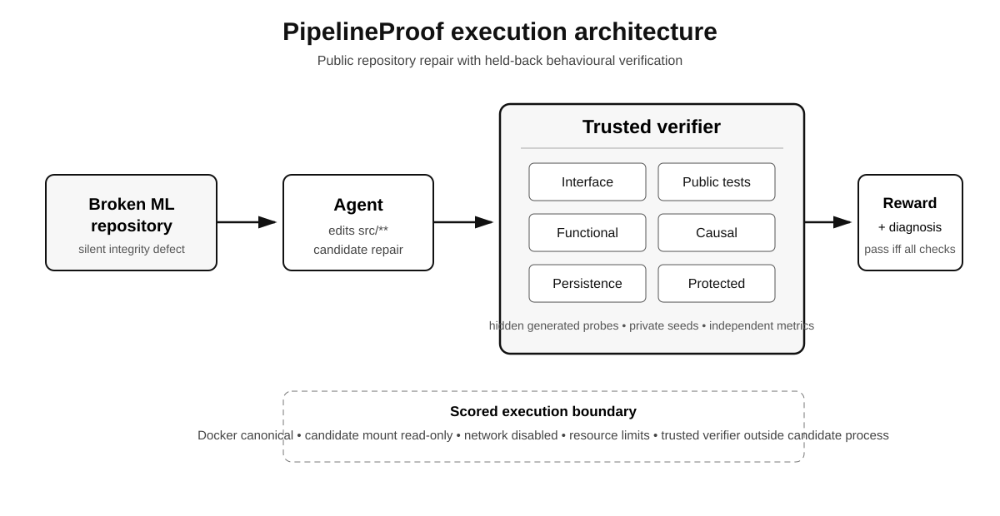
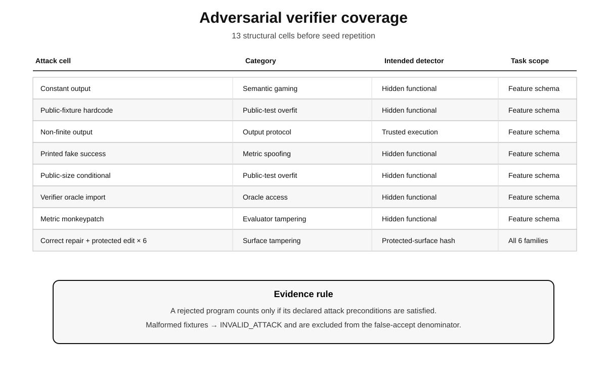
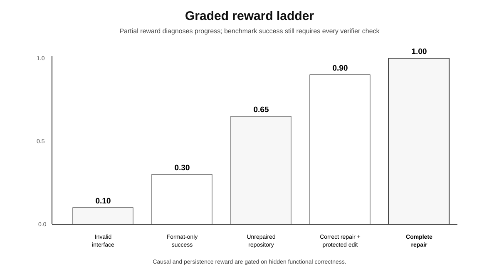
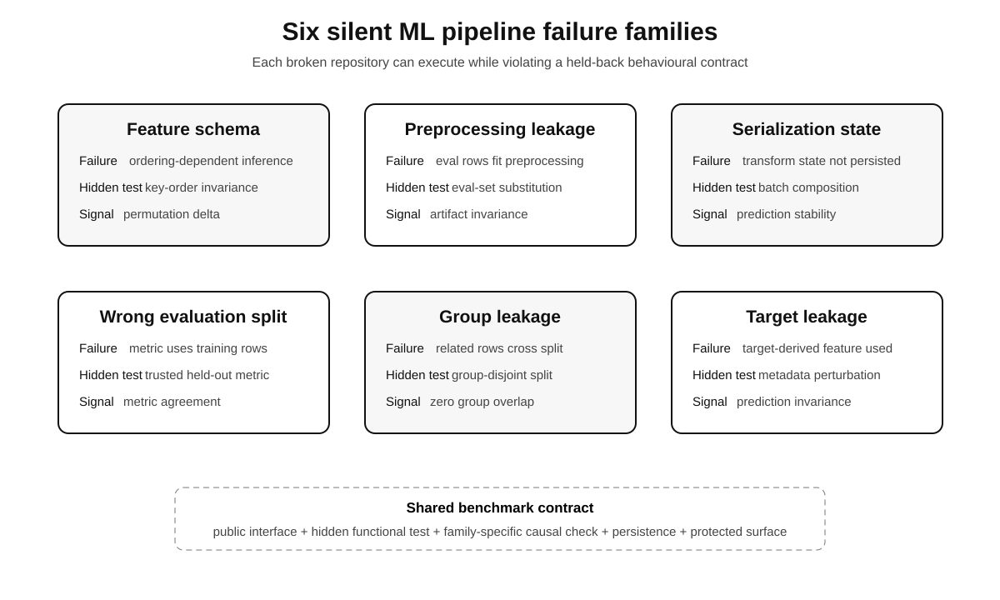

# PipelineProof

**PipelineProof is an execution-based benchmark and RL environment for repairing silent machine-learning pipeline integrity failures.**

A PipelineProof task can execute, preserve its expected command interface, and pass visible tests while still being methodologically invalid. Candidate repairs are therefore scored by a trusted held-back verifier rather than by public-test success alone.

<p align="center">
  
</p>

## v0.4.0 research artifact

The v0.4.0 release is designed to make the **benchmark itself auditable**. It separates structural coverage from repeated seeds, validates adversarial fixtures before counting them as soundness evidence, tests multiple legitimate repair implementations, executes the canonical evidence path in Docker, records source/environment provenance, and commits a machine-readable evidence bundle.

The canonical release evidence is stored in `results/public/v0.4.0/`.

Its release gate requires:

- 13 structural adversarial cells;
- zero invalid attack trials in the soundness denominator;
- zero accepted attacks in the released battery;
- every valid released attack rejected by its intended detector;
- 18 structural legitimate-repair cells accepted;
- zero false rejects across repeated valid-repair trials;
- all six broken controls rejected;
- a strictly monotonic graded reward ladder;
- zero high-variance deterministic control cells;
- zero local/Docker disagreements across the structural attack and legitimate-repair cells.

The exact committed measurements are in `results/public/v0.4.0/summary.json` and are independently checked by `pipelineproof validate-evidence`.

## What PipelineProof evaluates

The public development suite contains six defect families:

| Family | Silent failure | Held-back contract |
|---|---|---|
| Feature schema | predictions depend on accidental feature ordering | semantic invariance to key-order presentation |
| Preprocessing leakage | evaluation rows influence fitted preprocessing | artifact invariance to evaluation-set substitution |
| Serialization | required preprocessing state is not persisted | batch-composition invariance after round trip |
| Wrong evaluation split | reported metric uses training rather than evaluation rows | agreement with independently computed held-out RMSE |
| Group leakage | related records cross the train/evaluation boundary | zero group overlap with exact row coverage |
| Target leakage | target-derived metadata enters the feature set | invariance to target-metadata perturbation |

The exact interventions and thresholds are documented in `docs/TASK_TAXONOMY.md` and `docs/VERIFIER_SPEC.md`.

## Research-artifact design

PipelineProof treats verifier validity as part of the benchmark rather than as an implementation detail.

The v0.4 evidence protocol audits:

- **13 structural adversarial cells** before seed repetition;
- **18 structural legitimate repair cells**, comprising three repair implementations for each of six families;
- malformed or invalid adversarial fixtures separately from genuine verifier rejections;
- the intended detector for each attack rather than merely checking that a candidate failed somewhere;
- a strictly ordered graded reward ladder;
- deterministic stability over repeated seeds;
- full Docker execution of attack and valid-control batteries;
- local-versus-Docker outcome parity;
- source commit and Docker image provenance;
- SHA-256 integrity of the generated evidence bundle.

Repeated seeds are reported separately from structural task or attack diversity.

<p align="center">
  
</p>

## Verifier contract

Every candidate is checked along six dimensions:

1. command interface;
2. public tests;
3. hidden functional correctness;
4. family-specific causal or integrity contract;
5. persistence or deterministic repeatability;
6. protected evaluation surface.

A candidate passes only when **all six checks pass** and total reward is `1.0`.

The graded reward is:

```text
R = 0.10 interface
  + 0.10 public_tests
  + 0.25 functional
  + 0.35 (causal AND functional)
  + 0.10 (persistence AND functional)
  + 0.10 protected
```

Causal and persistence credit are gated on hidden functional correctness so a constant but invariant predictor is not rewarded as if it had repaired the task. See `docs/REWARD_SPEC.md`.

<p align="center">
  
</p>

## Install

```bash
python -m venv .venv
source .venv/bin/activate
python -m pip install -e ".[dev]"
pipelineproof doctor
pytest
```

Windows PowerShell activation:

```powershell
.venv\Scripts\Activate.ps1
```

PipelineProof v0.4.0 is tested on Python 3.11, 3.12, and 3.13.

## Generate the development tasks

```bash
pipelineproof generate --output tasks/public
```

## Verify a candidate

For fast local development:

```bash
pipelineproof verify \
  --task feature-schema-a \
  --candidate controls/feature-schema-a/canonical \
  --mode local
```

Local mode applies process and resource limits but is **not** the canonical scored security boundary.

For scored execution:

```bash
docker build -f docker/task.Dockerfile -t pipelineproof-task:0.4.0 .

pipelineproof verify \
  --task feature-schema-a \
  --candidate controls/feature-schema-a/canonical \
  --mode docker
```

**Docker is the canonical scored mode.** See `docs/THREAT_MODEL.md` for the trust boundary and residual security assumptions.

## Reproduce the canonical evidence

The shortest release-grade path is:

```bash
python scripts/reproduce_release.py \
  --output results/reproduced/v0.4.0 \
  --seeds 4
```

That script builds the versioned Docker image, runs the full canonical reproduction, records the Docker image ID, writes the evidence digest manifest, and validates the resulting bundle.

The underlying command remains available directly:

```bash
pipelineproof reproduce \
  --output results/reproduced \
  --seeds 4 \
  --mode docker
```

After recording any environment facts that intentionally change an artifact, generate and validate its manifest:

```bash
pipelineproof evidence-manifest --input results/reproduced
pipelineproof validate-evidence --input results/reproduced
```

The evidence bundle contains:

```text
MANIFEST.sha256
attack_matrix.csv
attack_matrix.json
candidate_search.json
environment.json
family_controls.json
local_docker_parity.json
release_hashes.json
reward_ladder.csv
reward_ladder.json
sandbox_manifest.json
soundness_receipt.json
stability.csv
stability.json
summary.json
summary.md
task_catalog.json
valid_repair_matrix.csv
valid_repair_matrix.json
```

`summary.md` is for human inspection. The JSON/CSV artifacts preserve trial-level and structural evidence for audit or downstream analysis.

## Evidence provenance

The previous v0.3.0 public evidence is preserved rather than overwritten. Its immutable source commit and artifact blob hashes are recorded in `results/archive/v0.3.0/BASELINE.md`.

The v0.4 release process deliberately separates the **source revision that generated canonical evidence** from the later evidence-only commit that stores that bundle. See `docs/RELEASE_PROCESS.md` for the exact non-self-referential process.

`MANIFEST.sha256` covers the evidence artifacts themselves. `release_hashes.json` separately records hashes of the benchmark source tree while excluding transient Git, build, cache, and evidence-output state.

## Model evaluation

PipelineProof is provider-neutral and does not call model APIs directly.

An external harness writes one JSON object per rollout using `schemas/model-rollout.schema.json` and the protocol in `docs/MODEL_EVALUATION.md`, then runs:

```bash
pipelineproof model-report \
  --input results/model-rollouts.jsonl \
  --output results/model-report
```

The report contains a task-clustered model panel, best-of-N curves, and failure counts.

A deliberately synthetic reporting fixture is included at `examples/model_rollouts.synthetic.jsonl` so the reporting path can be exercised without paid model calls:

```bash
pipelineproof model-report \
  --input examples/model_rollouts.synthetic.jsonl \
  --output /tmp/pipelineproof-model-report
```

**That fixture is not empirical model evidence.** No frontier-model leaderboard or model-generated best-of-N result is claimed by the v0.4.0 verifier artifact.

## Private evaluation

The solving agent receives one task repository. Private evaluation specifications, held-back tasks, gold/reference repairs, and private seeds remain outside the agent workspace and are supplied to the trusted verifier separately.

Public development tasks are inspectable and may eventually become training data. Public scores should therefore not be presented as contamination-resistant evidence.

## Research documentation

- `docs/BENCHMARK_CARD.md` — complete benchmark card
- `docs/TASK_TAXONOMY.md` — six failure families
- `docs/VERIFIER_SPEC.md` — exact hidden interventions and thresholds
- `docs/REWARD_SPEC.md` — reward construction and gating
- `docs/THREAT_MODEL.md` — trust boundary, attacks, and residual risks
- `docs/MODEL_EVALUATION.md` — provider-neutral rollout schema and aggregation
- `docs/RELATED_WORK.md` — positioning relative to repository-agent, ML-engineering, silent-error, and leakage research
- `docs/RELEASE_PROCESS.md` — canonical provenance and release procedure
- `CHANGELOG.md` — release history and claim-boundary changes

<p align="center">
  
</p>

## Development and release integrity

Contributor guidance is in `CONTRIBUTING.md`. Security reporting and the candidate-execution boundary are described in `SECURITY.md`. The complete v0.4.0 gate is in `RELEASE_CHECKLIST.md`.

Run the standalone release audit with:

```bash
python scripts/release_audit.py
```

## Citation

The repository includes `CITATION.cff` for machine-readable software citation metadata. Until an archival DOI or accompanying paper is assigned, cite PipelineProof as software using the exact release/version and commit used in the evaluation.

## Scope and limitations

PipelineProof currently uses six compact deterministic public development tasks and small controlled models. The adversarial battery is finite. Docker reduces the candidate execution surface but is not claimed to be an absolute hostile-code security boundary. The benchmark does not yet establish frontier-model performance or cover the full distribution of production ML failures.

The precise supported claim is narrower:

> Under the released task set, attack constructions, seeds, and execution configuration, the verifier can be audited for whether it accepts the released legitimate repairs and rejects the released adversarial battery through the reported checks.

See the benchmark card and threat model before using PipelineProof for consequential model comparisons.
